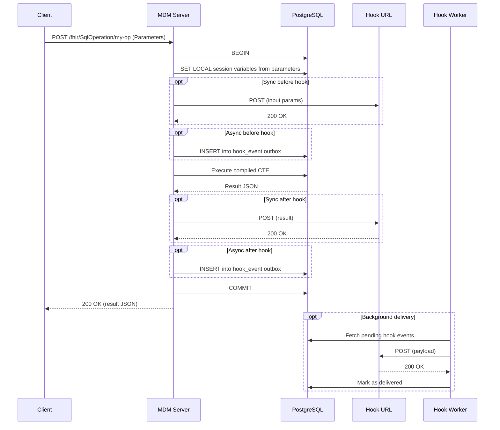
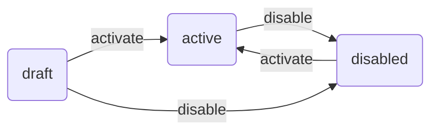

# Custom SQL Operations

## Overview

Custom SQL Operations let you define named, reusable data pipelines as ordered sequences of SQL steps. Each operation is stored in the database, compiled into a single atomic SQL statement (using CTEs), and exposed as an HTTP endpoint. Operations can be created, tested, and managed through the Admin UI — no code changes or redeployment required.

This framework powers the built-in **merge** and **unmerge** operations and can be used to create any custom data operation your workflow requires.


The `$merge` and `$unmerge` endpoints require their corresponding SQL operations to be imported and activated. See [Import merge and unmerge operations](#import-merge-and-unmerge-operations) below.


## How it works

An operation consists of:

- **Input parameters** — named values passed at execution time via FHIR Parameters
- **SQL steps** — ordered SQL queries that form a pipeline; each step can reference results of previous steps
- **Hooks** (optional) — HTTP callbacks executed before and/or after the pipeline

At save time, all steps are compiled into a single SQL CTE (Common Table Expression). At execution time, the entire pipeline runs inside a single database transaction — either everything succeeds and commits, or everything rolls back.



## Import merge and unmerge operations

MDM ships with two default operation definitions for merge and unmerge. These must be imported into the database for the `$merge` and `$unmerge` endpoints to work via the operations framework.




Open the Admin UI and navigate to **Operations**.




Click **Import** and paste the contents of the `merge.json` file shipped with MDM (located in the `operations/` directory).




After import, the operation appears in **draft** status. Click **Activate** to make it available for execution.




Repeat for `unmerge.json`.




Alternatively, import via the Admin API:

```http
POST /admin/operations/import
Content-Type: application/json

<contents of operations/merge.json>
```

Then activate:

```http
POST /admin/operations/<id>/activate
```

To disable an operation:

```http
POST /admin/operations/<id>/disable
```

## Create a custom operation




Open **Admin UI** and go to the **Operations** section.




Click **New** and enter a name for your operation.




Add SQL steps in the **Steps** tab. Each step has a name (used as the CTE alias) and a SQL query. Steps can reference previous steps by name.




Configure input parameters in the **Settings** tab.




Use **Debug** to test step-by-step in a sandbox (always rolls back) or **Run** to execute all steps at once.




When ready, click **Activate** to expose the operation as an HTTP endpoint.





## Execute an operation

Call an active operation via its HTTP endpoint:

```http
POST /fhir/SqlOperation/archive-patient
Content-Type: application/fhir+json

{
  "resourceType": "Parameters",
  "parameter": [
    {"name": "patient_id", "valueString": "pt-123"}
  ]
}
```

The response contains the JSON result produced by the last step of the pipeline:

```json
{"status": "archived", "patient_id": "pt-123"}
```

## Operation definition reference

### Input parameters

Each parameter becomes a PostgreSQL session variable accessible in SQL steps via `current_setting('mpi.<parameter_name>')`.

| Property | Type | Required | Description |
|----------|------|----------|-------------|
| `name` | string | Yes | Parameter name (used in `current_setting`) |
| `type` | string | Yes | `string`, `integer`, or `reference` |
| `required` | boolean | Yes | Whether the parameter must be provided |
| `description` | string | No | Human-readable description |

### Steps

Steps are compiled into a single CTE. Each step can reference previous steps by their `name` as if they were tables.

| Property | Type | Required | Description |
|----------|------|----------|-------------|
| `id` | string | Yes | Unique step identifier (e.g., `n1`) |
| `name` | string | Yes | CTE alias — must be unique, used to reference this step's results |
| `sql` | string | Yes | SQL query for this step |
| `order` | integer | Yes | Execution order (ascending) |

### Hooks

Optional HTTP callbacks executed before and/or after the pipeline. Each hook is configured under `hooks.before` or `hooks.after` in the operation definition.

| Property | Type | Default | Description |
|----------|------|---------|-------------|
| `url` | string | — | HTTP endpoint to call (POST with JSON body) |
| `mode` | string | `"sync"` | `"sync"` or `"async"` — see below |
| `fail_on_error` | boolean | `false` | Sync only. If `true`, a non-2xx response triggers a transaction rollback |
| `timeout_ms` | integer | `5000` | Sync only. HTTP request timeout in milliseconds |
| `payload_step` | string | — | Async after-hook only. Name of the step whose output becomes the hook payload |
| `max_attempts` | integer | `5` | Async only. Maximum delivery attempts before marking as failed |

#### Sync hooks

The default mode. The HTTP call happens **inside** the database transaction. If the hook returns a non-2xx response and `fail_on_error` is `true`, the entire transaction is rolled back.

```json
{
  "hooks": {
    "before": {
      "url": "https://audit.example.com/check",
      "fail_on_error": true,
      "timeout_ms": 3000
    }
  }
}
```

#### Async hooks

When `mode` is `"async"`, the hook is not called immediately. Instead, an event is inserted into the `mpi.hook_event` outbox table **inside the same transaction**. If the operation rolls back, the hook event is also discarded — guaranteeing consistency.

A background **hook worker** picks up pending events and delivers them with automatic retries.

```json
{
  "hooks": {
    "after": {
      "url": "https://notifications.example.com/webhook",
      "mode": "async",
      "payload_step": "final_result",
      "max_attempts": 5
    }
  }
}
```

The `payload_step` property lets you choose which step's output is sent as the hook payload. If omitted, the pipeline's final result is used.

#### Enable the hook worker

The hook worker is a background process that delivers async hook events. Configure it with the following environment variables:

```bash
# Enable the hook worker
MPI_HOOK_WORKER_ENABLE=true

# Polling interval in milliseconds
MPI_HOOK_WORKER_INTERVAL=1000

# Number of events to process per batch
MPI_HOOK_WORKER_BATCH_SIZE=10

# PostgreSQL advisory lock ID (prevents concurrent workers)
MPI_HOOK_WORKER_LOCK_ID=99999
```

The worker polls the `mpi.hook_event` table for pending events, POSTs each payload to its URL, and marks events as `delivered` on success. On failure, events are retried up to `max_attempts` times before being marked as `failed`.

### Timeout

Set `timeout_ms` at the operation level to limit total SQL execution time. If the timeout is exceeded, the transaction is rolled back and an error is returned. The default is 30 seconds.

## Operation lifecycle

Operations follow a status-based lifecycle:



- **draft** — Initial status after creation or import. Can be edited and tested in the sandbox. Not callable via HTTP.
- **active** — Available for execution via HTTP endpoint. Can still be edited (changes take effect immediately).
- **disabled** — Not callable via HTTP. Can be re-activated.


Activating an operation requires that its SQL steps compile successfully. If compilation fails, the activation is rejected with an error.


## Sandbox: debug and test

The Admin UI includes a sandbox environment for testing operations without affecting production data. All sandbox executions run inside a transaction that is always rolled back.

- **Debug mode** — Execute steps one at a time, inspect intermediate results, and run ad-hoc SQL queries between steps
- **Run mode** — Execute all steps at once and see the final result

To start a sandbox session, select an operation in the Admin UI and click **Debug** or **Run**. If the operation has input parameters, you will be prompted to provide values before execution starts.

For general configuration and setup, see [Configure MDM module](configure-mdm-module.md). For details on the merge and unmerge workflows, see [Merging and Unmerging Records: $merge and $unmerge](merging-and-unmerging-records-usdmerge-and-usdunmerge.md).

