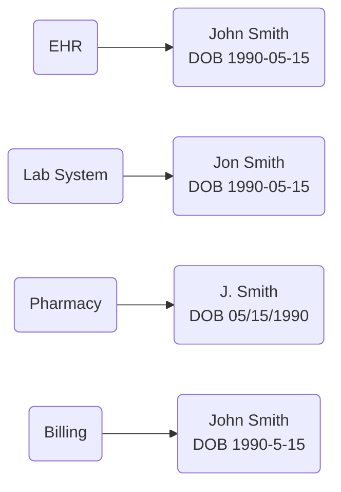
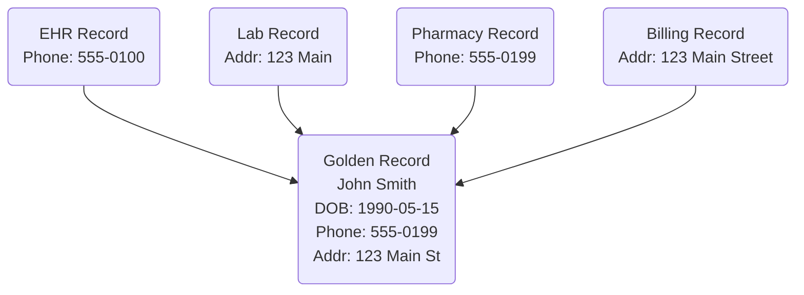
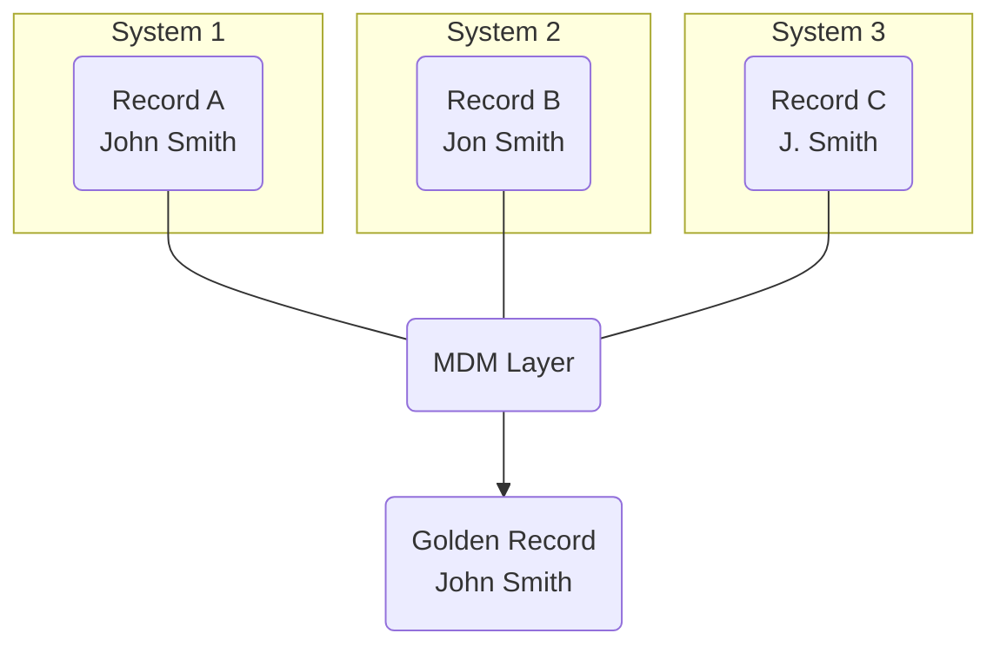
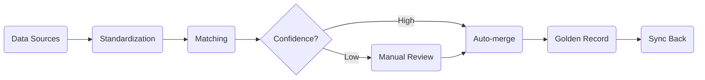

# MDM Theory

Master Data Management (MDM) is the practice of keeping your core data accurate, consistent, and unified across all systems. In healthcare, this means making sure that a patient is correctly identified no matter which system they visit.

## The Problem

Healthcare organizations deal with dozens of systems: EHRs, labs, pharmacies, billing, scheduling, and more. Each system stores its own copy of patient data. Over time, this leads to:

- **Duplicates** — the same patient registered multiple times with slight variations (e.g., "Jon Smith" vs "John Smith")
- **Fragmented records** — a patient's lab results live in one system, medications in another, and no one sees the full picture
- **Data conflicts** — one system says the address is "123 Main St", another says "123 Main Street, Apt 2"
- **Misidentification** — two different patients merged into one record, or one patient split into two



All four records above are the same patient — but no system knows that.

These problems directly affect patient safety, billing accuracy, and regulatory compliance.

## Core Concepts

### Golden Record

A golden record is the single, most accurate and complete representation of an entity (e.g., a patient). Instead of having five conflicting records across five systems, MDM creates one authoritative version — the golden record — that all systems can trust.




Think of the golden record as the "source of truth." When systems disagree about a patient's phone number, the golden record holds the correct one.


### Record Matching

Matching is the process of determining whether two records refer to the same real-world entity. There are two main approaches:

**Deterministic matching** compares records using exact rules. For example: "If Social Security Number matches exactly, it's the same patient." This is precise but brittle — a single typo breaks the match.

**Probabilistic matching** uses statistical algorithms to calculate a similarity score between records. It considers multiple fields (name, date of birth, address, phone) and weighs how likely a match is overall, even when some fields don't match perfectly.



```
Record A: John Smith, DOB 1990-05-15, SSN 123-45-6789
Record B: John Smith, DOB 1990-05-15, SSN 123-45-6789
→ Exact SSN match → Same patient ✓
```


```
Record A: Jon Smith, DOB 1990-05-15, Phone 555-0123
Record B: John Smith, DOB 1990-05-15, Phone 555-0123
→ Name similarity: 92%
→ DOB: exact match
→ Phone: exact match
→ Overall score: 95% → Likely the same patient ✓
```



### Record Linkage

Record linkage connects related records across different systems without necessarily merging them. Even if two systems store data differently, linkage establishes that "Record A in System 1" and "Record B in System 2" refer to the same patient.



This is important because:

- Source systems keep their own data intact
- The MDM layer knows which records belong together
- Any system can query the MDM layer to get the full picture

### Survivorship Rules

When multiple records describe the same entity, survivorship rules determine which values "win" and end up in the golden record. Examples:

- **Most recent** — use the latest updated value
- **Most frequent** — if three systems say "Male" and one says "Female", go with "Male"
- **Source priority** — trust the EHR over the billing system for clinical data
- **Longest** — for addresses, the most detailed version is often the most complete

### Deduplication

Deduplication is the process of finding and resolving duplicate records within a single system. It uses the same matching techniques but focuses on cleaning up one data source rather than linking across sources.

## How MDM Works in Practice





**Data comes in from multiple sources.** Patient records arrive from EHRs, labs, insurance systems, and other sources — each with its own format and data quality.


**Records are standardized.** Names, addresses, and other fields are cleaned and normalized (e.g., "St." becomes "Street", "NY" becomes "New York").


**Matching algorithms run.** The system compares incoming records against existing ones to find potential matches using deterministic and probabilistic rules.


**Matches are resolved.** High-confidence matches are merged automatically. Low-confidence matches go to a review queue for manual resolution.


**Golden records are created or updated.** Survivorship rules determine the best values, and the golden record is assembled.


**Systems are synchronized.** The golden record is shared back to source systems, so everyone works with the same accurate data.



## Why MDM Matters in Healthcare

| Without MDM | With MDM |
|---|---|
| Duplicate patient records cause billing errors | Each patient has one clean, unified record |
| Allergies recorded in one system are invisible in another | Complete patient history is available everywhere |
| Patient matching relies on manual review | Automated matching with confidence scores |
| No way to know if two records are the same person | Clear linkage across all source systems |
| Data quality degrades over time | Continuous deduplication keeps data clean |

## Next Steps

- [Getting Started](getting-started.md) — set up MDMbox for your organization
- [API Reference](api.md) — integrate MDMbox with your systems
