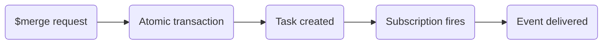

# Notifications

After a `$merge` or `$unmerge` operation completes, external systems often need to react — update search indexes, sync to a data warehouse, trigger workflows. MDMbox supports this via [Aidbox Topic-Based Subscriptions](https://www.health-samurai.io/docs/aidbox/modules/topic-based-subscriptions/aidbox-topic-based-subscriptions), a built-in publish/subscribe mechanism that delivers events to webhooks, Kafka, GCP Pub/Sub, and other destinations.

## How it works

Every [merge](merge-operation.md) or unmerge operation creates a `Task` resource as part of its atomic transaction. The Task carries a code (`merge` or `unmerge`) and a `businessStatus` reflecting the outcome. When a matching Task is created or updated, the subscription fires and delivers the event to the configured destination.



The setup consists of two resources:

1. **AidboxSubscriptionTopic** — declares _what_ to watch (resource type, interactions, FHIRPath filter)
2. **AidboxTopicDestination** — declares _where_ to deliver and with what guarantees

## What the recipient gets

The notification payload contains the Task resource. From the Task, the recipient can reconstruct the full picture of what happened:

- **Task** — contains `focus` (target resource), `for` (source resource), `businessStatus` (outcome), and `relevantHistory` pointing at the Provenance
- **Provenance** — fetch via `GET /Provenance?target=Task/<task-id>`:
  - `target` — every resource affected by the operation
  - `entity[].what` — versioned references to pre-operation resource states (e.g. `Patient/456/_history/3`)
  - `recorded` — timestamp of the operation

This allows the recipient to know exactly which resources changed, what their state was before the operation, and fetch their current state to compute deltas.

## AidboxSubscriptionTopic

Defines the trigger criteria. Example for merge tasks:

```json
{
  "resourceType": "AidboxSubscriptionTopic",
  "id": "task-merge",
  "url": "http://mdmbox.dev/SubscriptionTopic/task-merge",
  "status": "active",
  "trigger": [
    {
      "resource": "Task",
      "supportedInteraction": ["create", "update"],
      "fhirPathCriteria": "code.coding.where(system='http://mdmbox.dev/fhir/CodeSystem/task-code' and code='merge').exists()"
    }
  ]
}
```

| Field | Description |
| --- | --- |
| `url` | Canonical URL — referenced by the destination to bind topic to delivery |
| `trigger[].resource` | FHIR resource type to watch |
| `trigger[].supportedInteraction` | Which interactions fire the trigger (`create`, `update`, `delete`) |
| `trigger[].fhirPathCriteria` | FHIRPath expression that must evaluate to `true` for the event to fire |

To subscribe to unmerge events, create a second topic with `code='unmerge'` in the FHIRPath filter, or broaden the filter to match both.

## AidboxTopicDestination

Defines the delivery target and parameters. Example using a webhook with at-least-once delivery:

```json
{
  "resourceType": "AidboxTopicDestination",
  "id": "task-merge-webhook",
  "meta": {
    "profile": [
      "http://aidbox.app/StructureDefinition/aidboxtopicdestination-webhook-at-least-once"
    ]
  },
  "kind": "webhook-at-least-once",
  "topic": "http://mdmbox.dev/SubscriptionTopic/task-merge",
  "parameter": [
    {"name": "endpoint", "valueUrl": "https://your-service.example.com/on-merge"},
    {"name": "maxMessagesInBatch", "valueUnsignedInt": 1},
    {"name": "timeout", "valueUnsignedInt": 10}
  ]
}
```

| Field | Description |
| --- | --- |
| `kind` | Delivery mechanism: `webhook-at-least-once`, `webhook-at-most-once`, `kafka-at-least-once`, `kafka-best-effort`, `gcp-pubsub-at-least-once` |
| `topic` | Canonical URL of the AidboxSubscriptionTopic to subscribe to |
| `parameter` | Destination-specific settings (endpoint URL, batch size, timeout, etc.) |

See [Aidbox Topic-Based Subscriptions docs](https://www.health-samurai.io/docs/aidbox/modules/topic-based-subscriptions/aidbox-topic-based-subscriptions) for the full list of destination kinds and their parameters.
