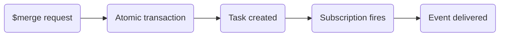

# Notifications

Use [Aidbox Topic-Based Subscriptions](https://www.health-samurai.io/docs/aidbox/modules/topic-based-subscriptions/aidbox-topic-based-subscriptions) to notify another system when a merge or unmerge completes. Both server-managed and client-plan operations create Tasks that a subscription can watch.

## How it works

Every [merge](merge-operation.md) or unmerge operation creates a `Task` resource as part of its atomic transaction. The Task carries a code (`merge` or `unmerge`) and a `businessStatus` reflecting the outcome. When a matching Task is created or updated, the subscription fires and delivers the event to the configured destination.



The setup consists of two resources:

1. **AidboxSubscriptionTopic** — declares _what_ to watch (resource type, interactions, FHIRPath filter)
2. **AidboxTopicDestination** — declares _where_ to deliver and with what guarantees

## What the recipient gets

The webhook below receives a FHIR Bundle containing an AidboxSubscriptionStatus entry and the matching Task entries. Read Tasks from `entry[].resource`; the HTTP body is not a single Task. See the [Aidbox webhook format](https://www.health-samurai.io/docs/aidbox/tutorials/subscriptions-tutorials/webhook-aidboxtopicdestination).

Use each Task to inspect the operation:

- **Task** — contains `focus` (target resource), `for` (source resource), and `businessStatus` (outcome)
- **Provenance** — fetch from Aidbox via `GET /fhir/Provenance?target=Task/<task-id>`:
  - `target` — every resource affected by the operation
  - `entity[].what` — versioned references to pre-operation resource states (e.g. `Patient/456/_history/3`)
  - `recorded` — timestamp of the operation

This allows the recipient to know exactly which resources changed, what their state was before the operation, and fetch their current state to compute deltas.

## AidboxSubscriptionTopic

Create this topic on the **Aidbox host** to watch newly completed merge Tasks:

```http
PUT https://<aidbox-host>/fhir/AidboxSubscriptionTopic/task-merge
Content-Type: application/fhir+json
```

```json
{
  "resourceType": "AidboxSubscriptionTopic",
  "id": "task-merge",
  "url": "https://mdm.health-samurai.io/fhir/SubscriptionTopic/task-merge",
  "status": "active",
  "trigger": [
    {
      "resource": "Task",
      "supportedInteraction": ["create"],
      "fhirPathCriteria": "code.coding.where(system='https://mdm.health-samurai.io/fhir/CodeSystem/operation-task-code' and code='merge').exists()"
    }
  ]
}
```

| Field | Description |
| --- | --- |
| `url` | Canonical URL — referenced by the destination to bind topic to delivery |
| `trigger[].resource` | FHIR resource type to watch |
| `trigger[].supportedInteraction` | Which interactions fire the trigger (`create`, `update`, `delete`) |
| `trigger[].fhirPathCriteria` | FHIRPath expression that must evaluate to `true` for the event to fire |

To subscribe to unmerge events, create a second topic with `code='unmerge'` in the FHIRPath filter, or broaden the filter to match both.

The example watches creation only. Including `update` would also notify you when unmerge changes the original merge Task to `businessStatus=unmerged`; that update is not a new merge.

## AidboxTopicDestination

Create the destination on the Aidbox host, replacing the endpoint with a URL reachable from Aidbox:

```http
POST https://<aidbox-host>/fhir/AidboxTopicDestination
Content-Type: application/fhir+json
```

```json
{
  "resourceType": "AidboxTopicDestination",
  "id": "task-merge-webhook",
  "meta": {
    "profile": [
      "http://health-samurai.io/fhir/core/StructureDefinition/aidboxtopicdestination-webhookAtLeastOnceProfile"
    ]
  },
  "kind": "webhook-at-least-once",
  "content": "full-resource",
  "topic": "https://mdm.health-samurai.io/fhir/SubscriptionTopic/task-merge",
  "parameter": [
    {
      "name": "endpoint",
      "valueUrl": "https://your-service.example.com/on-merge"
    },
    { "name": "maxMessagesInBatch", "valueUnsignedInt": 1 },
    { "name": "timeout", "valueUnsignedInt": 10 }
  ]
}
```

| Field | Description |
| --- | --- |
| `kind` | Delivery mechanism; this example uses `webhook-at-least-once` |
| `topic` | Canonical URL of the AidboxSubscriptionTopic to subscribe to |
| `parameter` | Destination-specific settings (endpoint URL, batch size, timeout, etc.) |

See [Aidbox Topic-Based Subscriptions docs](https://www.health-samurai.io/docs/aidbox/modules/topic-based-subscriptions/aidbox-topic-based-subscriptions) for the full list of destination kinds and their parameters.

At-least-once delivery can repeat events. For this creation-only topic, handle each operation Task ID once. To stop notifications, delete `AidboxTopicDestination/task-merge-webhook` through Aidbox's FHIR API.
