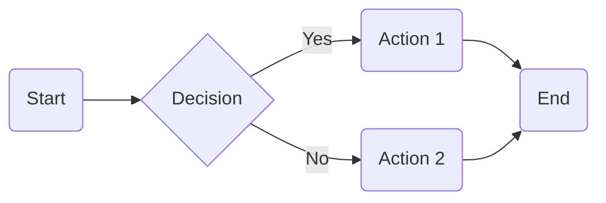
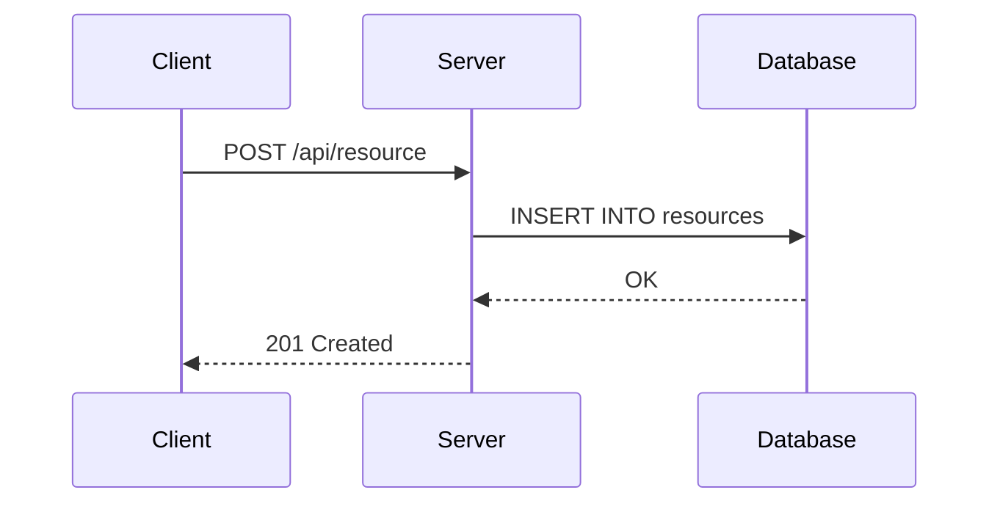
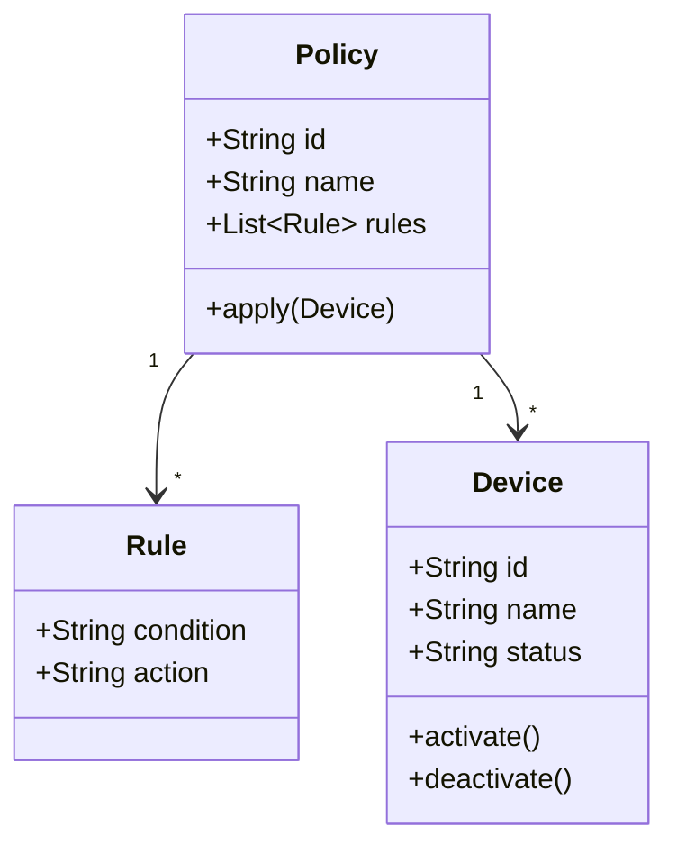
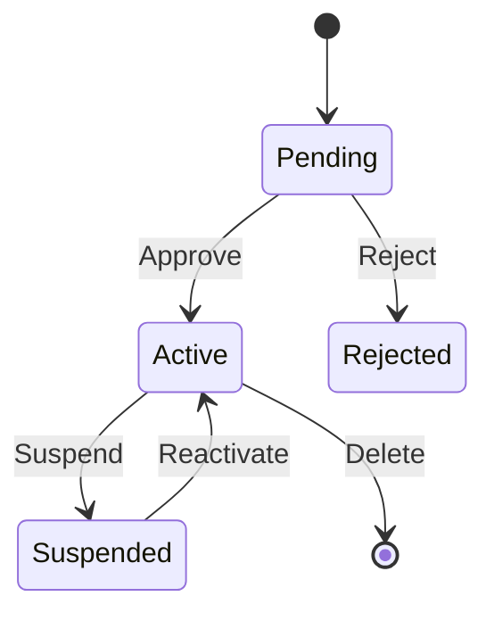
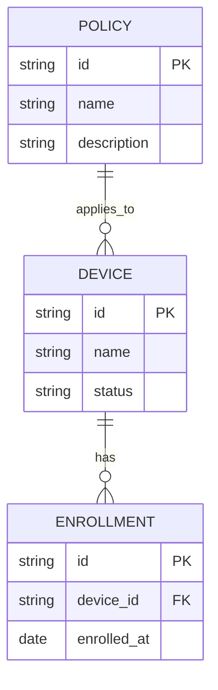
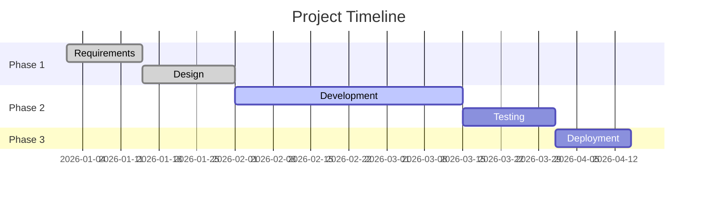

# Widgets Showcase

This page demonstrates all available widgets.

## Hints


This is an **info** hint. Use it for general information and tips.



This is a **success** hint. Use it to highlight successful outcomes or confirmations.



This is a **warning** hint. Use it to warn users about potential issues.



This is a **danger** hint. Use it for critical warnings and destructive actions.


## Tabs



Content for the first tab. You can include any markdown here.


Content for the second tab with a list:

- Item one
- Item two
- Item three


Content for the third tab with a code block:

```json
{
  "key": "value"
}
```



## Stepper



### Create a configuration file

Create a new `config.yaml` file in the root directory.


### Add required fields

Fill in the required configuration fields.

```yaml
server:
  host: localhost
  port: 8080
```


### Start the application

Run the application with the new configuration.



## Code Block with Title


```yaml
version: "3.8"
services:
  app:
    image: mdmbox:latest
    ports:
      - "8080:8080"
```


## Embeds

YouTube video embed:



Link card embed:



## Content Reference


[Getting Started](getting-started.md)


## Carousel






## Quote


MDMbox has transformed our master data management workflow. The documentation widgets make it easy to create rich, interactive content.


## Markdown Features

### Text Formatting

This is **bold text**, this is *italic text*, and this is ***bold italic text***.

This is ~~strikethrough text~~ and this is `inline code`.

### Links

[External link](https://example.com) and [internal link](getting-started.md).

### Lists

Unordered list:

- First item
- Second item
  - Nested item
  - Another nested item
- Third item

Ordered list:

1. First step
2. Second step
   1. Sub-step A
   2. Sub-step B
3. Third step

### Task List

- [x] Completed task
- [ ] Incomplete task
- [x] Another completed task

### Table

| Column 1 | Column 2 | Column 3 |
| --------- | --------- | --------- |
| Row 1 | Data | Data |
| Row 2 | Data | Data |
| Row 3 | Data | Data |

### Blockquote

> This is a blockquote. It can contain **formatted text** and other elements.
>
> It can also span multiple paragraphs.

### Horizontal Rule

---

### Image


### Code Blocks

Inline: use the `config.yaml` file.

Fenced code block with syntax highlighting:

```sql
SELECT id, name, status
FROM devices
WHERE status = 'active'
ORDER BY name;
```

```python
def hello(name: str) -> str:
    return f"Hello, {name}!"
```

### Footnote

This text has a footnote[^1].

[^1]: This is the footnote content.

### Mermaid Diagrams

Flowchart:



Sequence diagram:



Class diagram:



State diagram:



Entity relationship diagram:



Gantt chart:



## Nested Widgets

Widgets can be nested. Here is a hint inside a tab:




This warning is nested inside a tab.





First nested step.


Second nested step.




